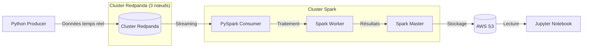

# Pipeline de Traitement et d'Analyse de Données en Temps Réel

Ce projet implémente une pipeline de données en temps réel utilisant Redpanda pour le streaming de données et Apache Spark pour le traitement des flux. Les données traitées sont automatiquement stockées dans AWS S3 pour des analyses ultérieures.

## Architecture

### Vue d'ensemble
La pipeline se compose des éléments suivants :
- Cluster Redpanda (3 nœuds) pour le streaming de données
- Cluster Apache Spark (1 maître, 1 worker) pour le traitement des flux
- Producteur Python pour la génération des données
- Consommateur PySpark pour le traitement des données
- Jupyter Notebook pour l'analyse des données
- AWS S3 pour le stockage des données

### Schéma de la Pipeline
Le diagramme ci-dessous illustre le flux de données à travers les différents composants du système :



Ce schéma montre comment :
1. Le producteur Python envoie les données vers le cluster Redpanda
2. Le cluster Redpanda gère le streaming des données
3. PySpark consomme et traite les données via le cluster Spark
4. Les résultats sont stockés dans AWS S3
5. Les analyses peuvent être effectuées via Jupyter Notebook

## Prérequis

- Docker et Docker Compose
- Compte AWS avec accès S3
- Connaissance de base de Kafka/Redpanda et Spark Streaming

## Mise en Route

1. **Configuration AWS S3**
   - Créer un bucket dans votre compte AWS S3
   - Créer deux répertoires dans votre bucket :
     - `checkpoints` pour le stockage des points de contrôle Spark
     - `results` pour le stockage des données traitées

2. **Configuration de l'Environnement**
   - Copier `.env.sample` vers `.env`
   - Mettre à jour les variables suivantes dans `.env` :
     - Clés d'accès AWS
     - Chemins S3 au format : `s3a://<nom_bucket>/results/`
     - Chemin des checkpoints : `s3a://<nom_bucket>/checkpoints/`

3. **Démarrer la Pipeline**
   ```bash
   docker-compose up -d
   ```

4. **Accès et Surveillance**
   - Console Redpanda : `http://localhost:8080`
   - Interface Spark Master : `http://localhost:8090`
   - Jupyter Notebook : `http://localhost:8888`

5. **Analyser les Résultats**
   - Ouvrir Jupyter Notebook à `http://localhost:8888`
   - Utiliser les notebooks fournis pour analyser les données stockées dans S3

6. **Arrêter la Pipeline**
   ```bash
   docker-compose down -v
   ```

## Structure du Projet

```
.
├── scripts/
│   ├── consumer.py
│   ├── create_tickets.py
│   ├── create_topic.py
│   └── producer.py
├── notebooks/
│   └── result_analysis.ipynb
├── Dockerfile.consumer
├── Dockerfile.jupyter
├── Dockerfile.producer
├── README.md
├── docker-compose.yml
├── requirements.txt
└── requirements_pyspark.txt
```

## Description des Composants

- `scripts/` : Contient tous les scripts Python pour la production et la consommation de données
- `notebooks/` : Notebooks Jupyter pour l'analyse des données
- `Dockerfile.*` : Différents Dockerfiles pour chaque service
- `docker-compose.yml` : Orchestre tous les services incluant le cluster Redpanda et le cluster Spark
- `requirements*.txt` : Dépendances Python pour les différents composants

## Services

Le fichier docker-compose.yml définit plusieurs services :
- Cluster Redpanda (3 nœuds)
- Console Redpanda pour la gestion du cluster
- Nœuds Spark Master et Worker
- Producteur Python
- Consommateur PySpark
- Jupyter Notebook pour l'analyse

Chaque service est configuré avec les réseaux, volumes et dépendances appropriés pour assurer une communication correcte et un flux de données fluide à travers la pipeline.

## Contribution

N'hésitez pas à soumettre des problèmes et des demandes d'amélioration !

## Licence

MIT